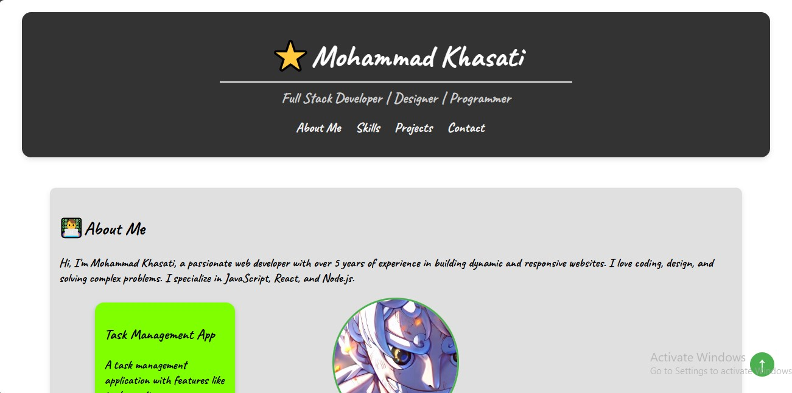
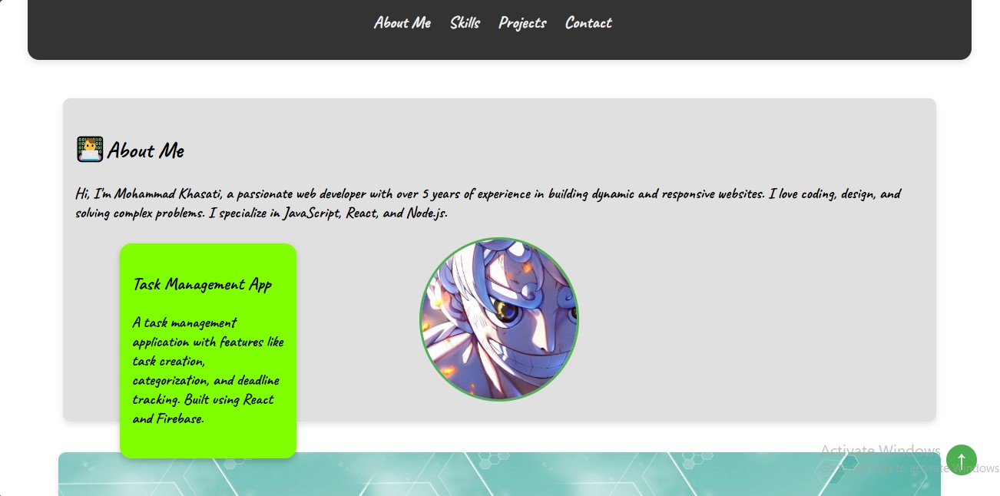
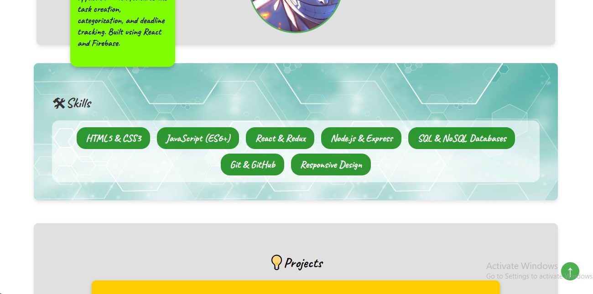
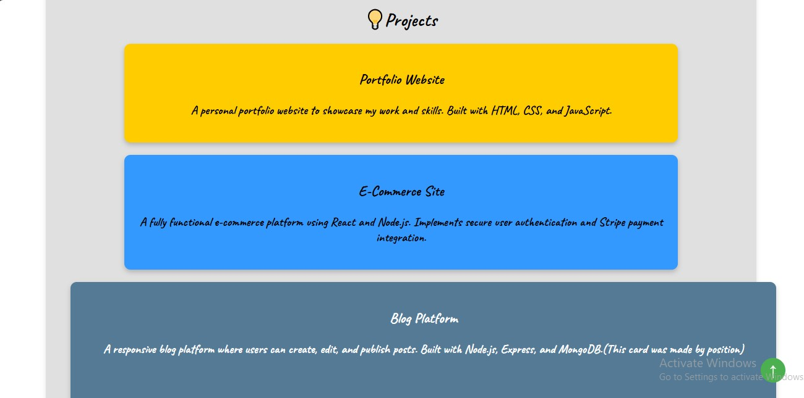
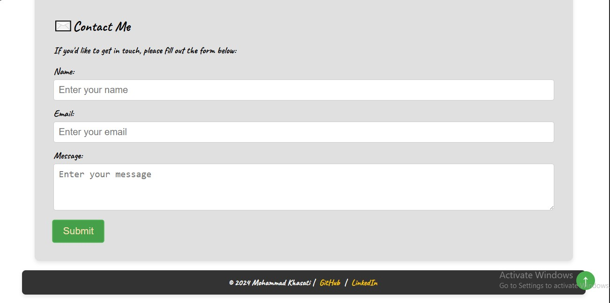

# Personal Portfolio Webpage

This project is a **personal portfolio webpage** built using **HTML** and **CSS**. The portfolio showcases various sections including About Me, Skills, Projects, and a Contact Form. It highlights experience in web development with interactive and visually appealing designs.

## Live Demo
Check out the live demo of the project [here](https://muhammad-kasati.github.io/Exercise-3/).

## Screenshots

### Header Section:

### About Me Section:

### Skills Section:

### Projects Section:

### Contact Section:

## Technologies Used
- **HTML**
- **CSS**

---

Thank you for visiting!
