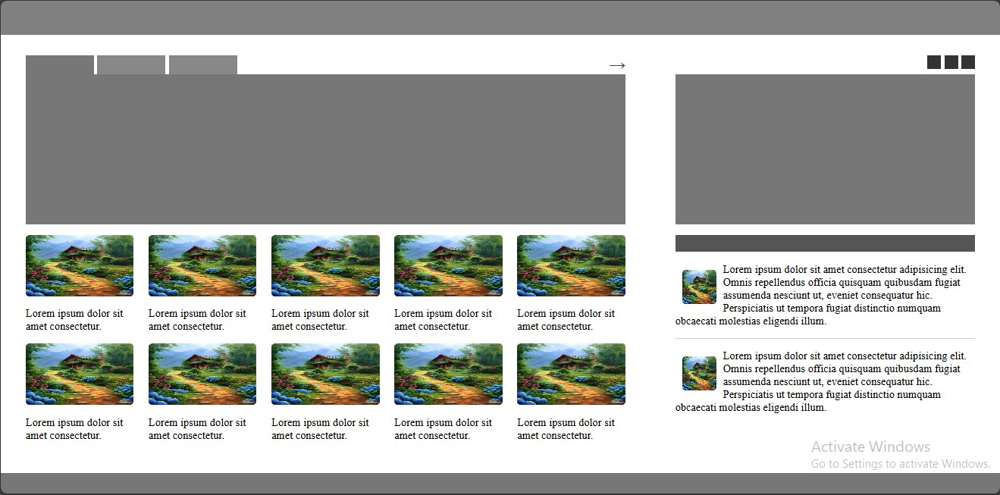

# Flexbox UI Layout Project

This project demonstrates the implementation of a responsive UI layout using only Flexbox and div elements. It includes a simple header, content area with images, and a footer, structured to adapt well across different screen sizes.

## Technologies Used

- **HTML**
- **CSS (Flexbox)**

---

Thank you for visiting!
